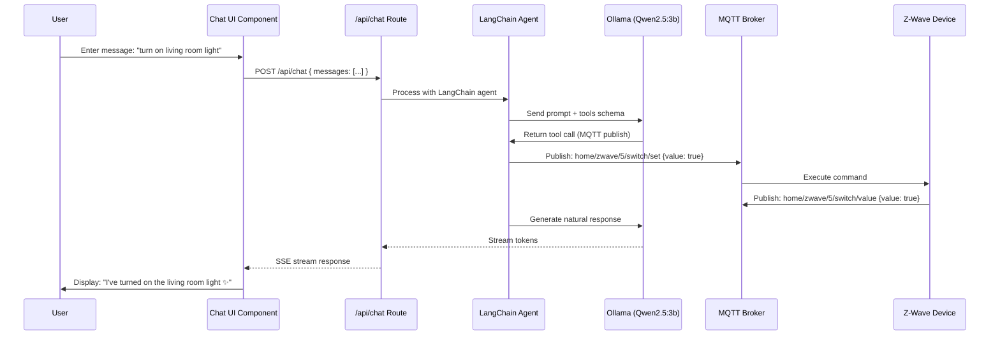
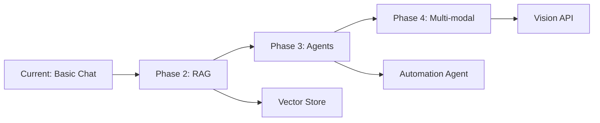

# Chatbot Design Document: Next.js + Ollama Chat Interface

## Overview

This document details the design for the AI-powered chatbot interface component of the MQTT + Ollama Home Automation system. The chatbot enables natural language control of smart home devices using locally-run Ollama models integrated through LangChain.js.

**Last Updated:** January 2025
**Target Presentation Date:** January 12, 2026

---

## Design Decision Summary

### Core Architecture Choice: LangChain.js + shadcn/ui

**Selected Approach:**
- **Backend:** LangChain.js with ChatOllama for AI processing
- **Streaming:** Next.js Route Handlers with TransformStream
- **Frontend:** shadcn/ui AI Chat Components
- **State Management:** React hooks (useState, useEffect)

**Key Rationale:**
1. ✅ **Tool calling required** - MQTT device control needs LangChain's tool ecosystem
2. ✅ **Local-first architecture** - No cloud AI dependencies (except Auth0)
3. ✅ **Production-ready UI** - shadcn/ui provides ChatGPT-quality interface
4. ✅ **Model flexibility** - Easy to swap Ollama models without code changes
5. ✅ **Future extensibility** - RAG, agents, and complex workflows supported

---

## System Architecture

### Chat Flow Diagram



---

## Component Design

### 1. Backend Architecture

#### API Route Handler (`app/api/chat/route.ts`)

**Responsibilities:**
- Authenticate user via Auth0
- Initialize LangChain agent with tools
- Stream Ollama responses to client
- Handle errors gracefully

**Implementation Pattern:**

```typescript
// app/api/chat/route.ts
import { ChatOllama } from '@langchain/ollama';
import { HttpResponseOutputParser } from 'langchain/output_parsers';
import { createMQTTTool, createDeviceControlTool } from '@/lib/langchain/tools';
import { getSession } from '@auth0/nextjs-auth0';

export async function POST(req: Request) {
  // 1. Authentication
  const session = await getSession();
  if (!session) {
    return new Response('Unauthorized', { status: 401 });
  }

  // 2. Parse request
  const { messages } = await req.json();

  // 3. Initialize LangChain agent
  const model = new ChatOllama({
    baseUrl: process.env.OLLAMA_BASE_URL || 'http://localhost:11434',
    model: process.env.OLLAMA_MODEL || 'qwen2.5:3b',
    temperature: 0.1,
  });

  // 4. Bind tools
  const tools = [
    createMQTTTool(),
    createDeviceControlTool(),
  ];

  const modelWithTools = model.bind({ tools });

  // 5. Stream response
  const parser = new HttpResponseOutputParser();
  const stream = await modelWithTools.pipe(parser).stream(messages);

  return new Response(stream, {
    headers: {
      'Content-Type': 'text/event-stream',
      'Cache-Control': 'no-cache',
      'Connection': 'keep-alive',
    },
  });
}
```

#### LangChain Tools

**MQTT Tool** (`lib/langchain/tools/mqtt-tool.ts`)

```typescript
import { DynamicTool } from '@langchain/core/tools';
import { mqttClient } from '@/lib/mqtt/client';

export function createMQTTTool() {
  return new DynamicTool({
    name: 'mqtt_publish',
    description: `
      Publishes a message to an MQTT topic to control smart home devices.

      Parameters (as JSON string):
      - topic: MQTT topic path (e.g., "home/zwave/5/switch/set")
      - payload: Message payload (e.g., {"value": true})

      Example: {"topic": "home/zwave/5/switch/set", "payload": {"value": true}}
    `,
    func: async (input: string) => {
      try {
        const { topic, payload } = JSON.parse(input);
        await mqttClient.publish(topic, JSON.stringify(payload));
        return `Successfully published to ${topic}`;
      } catch (error) {
        return `Error: ${error.message}`;
      }
    },
  });
}
```

**Device Control Tool** (`lib/langchain/tools/device-tool.ts`)

```typescript
import { DynamicTool } from '@langchain/core/tools';
import { prisma } from '@/lib/db';
import { mqttClient } from '@/lib/mqtt/client';

export function createDeviceControlTool() {
  return new DynamicTool({
    name: 'control_device',
    description: `
      Controls a smart home device by friendly name or room.

      Parameters (as JSON string):
      - deviceName: Friendly name (e.g., "living room light", "bedroom lamp")
      - action: "on", "off", or "dim"
      - level: (optional) 0-100 for dimming

      Example: {"deviceName": "living room light", "action": "on"}
    `,
    func: async (input: string) => {
      try {
        const { deviceName, action, level } = JSON.parse(input);

        // Find device by friendly name
        const device = await prisma.device.findFirst({
          where: {
            friendlyName: {
              contains: deviceName,
              mode: 'insensitive',
            },
          },
        });

        if (!device) {
          return `Device "${deviceName}" not found`;
        }

        // Build MQTT message
        const topic = `${device.mqttTopic}/set`;
        const payload: any = {};

        if (action === 'on' || action === 'off') {
          payload.value = action === 'on';
        } else if (action === 'dim' && level !== undefined) {
          payload.value = level;
        }

        await mqttClient.publish(topic, JSON.stringify(payload));

        return `${device.friendlyName} turned ${action}`;
      } catch (error) {
        return `Error: ${error.message}`;
      }
    },
  });
}
```

---

### 2. Frontend Architecture

#### Chat UI Component (`components/ChatInterface.tsx`)

**Using shadcn/ui AI Chat Components:**

```typescript
'use client';

import { useState, useEffect, useRef } from 'react';
import { Button } from '@/components/ui/button';
import { Input } from '@/components/ui/input';
import { ScrollArea } from '@/components/ui/scroll-area';
import { ChatMessage } from '@/components/ChatMessage';

interface Message {
  id: string;
  role: 'user' | 'assistant';
  content: string;
  timestamp: Date;
}

export function ChatInterface() {
  const [messages, setMessages] = useState<Message[]>([]);
  const [input, setInput] = useState('');
  const [isLoading, setIsLoading] = useState(false);
  const scrollRef = useRef<HTMLDivElement>(null);

  // Auto-scroll to bottom on new messages
  useEffect(() => {
    if (scrollRef.current) {
      scrollRef.current.scrollTop = scrollRef.current.scrollHeight;
    }
  }, [messages]);

  const handleSubmit = async (e: React.FormEvent) => {
    e.preventDefault();
    if (!input.trim() || isLoading) return;

    const userMessage: Message = {
      id: crypto.randomUUID(),
      role: 'user',
      content: input,
      timestamp: new Date(),
    };

    setMessages((prev) => [...prev, userMessage]);
    setInput('');
    setIsLoading(true);

    try {
      const response = await fetch('/api/chat', {
        method: 'POST',
        headers: { 'Content-Type': 'application/json' },
        body: JSON.stringify({
          messages: [...messages, userMessage].map((m) => ({
            role: m.role,
            content: m.content,
          })),
        }),
      });

      const reader = response.body?.getReader();
      const decoder = new TextDecoder();
      let assistantContent = '';

      const assistantMessage: Message = {
        id: crypto.randomUUID(),
        role: 'assistant',
        content: '',
        timestamp: new Date(),
      };

      setMessages((prev) => [...prev, assistantMessage]);

      // Stream response
      while (true) {
        const { done, value } = await reader!.read();
        if (done) break;

        const chunk = decoder.decode(value);
        assistantContent += chunk;

        setMessages((prev) =>
          prev.map((m) =>
            m.id === assistantMessage.id
              ? { ...m, content: assistantContent }
              : m
          )
        );
      }
    } catch (error) {
      console.error('Chat error:', error);
      setMessages((prev) => [
        ...prev,
        {
          id: crypto.randomUUID(),
          role: 'assistant',
          content: 'Sorry, I encountered an error. Please try again.',
          timestamp: new Date(),
        },
      ]);
    } finally {
      setIsLoading(false);
    }
  };

  return (
    <div className="flex flex-col h-full">
      <ScrollArea ref={scrollRef} className="flex-1 p-4">
        {messages.map((message) => (
          <ChatMessage key={message.id} message={message} />
        ))}
        {isLoading && (
          <div className="flex items-center gap-2 text-muted-foreground">
            <div className="animate-pulse">●</div>
            <div className="animate-pulse delay-100">●</div>
            <div className="animate-pulse delay-200">●</div>
          </div>
        )}
      </ScrollArea>

      <form onSubmit={handleSubmit} className="p-4 border-t">
        <div className="flex gap-2">
          <Input
            value={input}
            onChange={(e) => setInput(e.target.value)}
            placeholder="Ask me to control your devices..."
            disabled={isLoading}
            className="flex-1"
          />
          <Button type="submit" disabled={isLoading || !input.trim()}>
            Send
          </Button>
        </div>
      </form>
    </div>
  );
}
```

#### Chat Message Component (`components/ChatMessage.tsx`)

```typescript
import { cn } from '@/lib/utils';
import { Avatar, AvatarFallback } from '@/components/ui/avatar';

interface ChatMessageProps {
  message: {
    role: 'user' | 'assistant';
    content: string;
    timestamp: Date;
  };
}

export function ChatMessage({ message }: ChatMessageProps) {
  const isUser = message.role === 'user';

  return (
    <div
      className={cn(
        'flex gap-3 mb-4',
        isUser ? 'flex-row-reverse' : 'flex-row'
      )}
    >
      <Avatar>
        <AvatarFallback>
          {isUser ? 'U' : 'AI'}
        </AvatarFallback>
      </Avatar>

      <div
        className={cn(
          'rounded-lg px-4 py-2 max-w-[80%]',
          isUser
            ? 'bg-primary text-primary-foreground'
            : 'bg-muted'
        )}
      >
        <p className="text-sm">{message.content}</p>
        <span className="text-xs opacity-50 mt-1 block">
          {message.timestamp.toLocaleTimeString()}
        </span>
      </div>
    </div>
  );
}
```

---

## State Management

### Message Flow

1. **User Input** → Add to local state
2. **API Request** → POST to `/api/chat` with message history
3. **Streaming Response** → Update assistant message in real-time
4. **Completion** → Finalize message, enable input

### Conversation History

**Storage Options:**

1. **Client-side (Session Storage)** - For demo simplicity
   ```typescript
   useEffect(() => {
     const saved = sessionStorage.getItem('chat-history');
     if (saved) setMessages(JSON.parse(saved));
   }, []);

   useEffect(() => {
     sessionStorage.setItem('chat-history', JSON.stringify(messages));
   }, [messages]);
   ```

2. **Server-side (SQLite)** - For production
   ```typescript
   // Save to Conversation table in database
   await prisma.conversation.createMany({
     data: messages.map(m => ({
       userId: session.user.sub,
       message: m.content,
       role: m.role,
     })),
   });
   ```

---

## UI/UX Design

### Design Principles

1. **ChatGPT-like familiarity** - Users expect familiar chat patterns
2. **Real-time feedback** - Show streaming responses
3. **Clear device actions** - Highlight when devices are controlled
4. **Error resilience** - Graceful error handling with retry options
5. **Accessibility** - Keyboard navigation, screen reader support

### Visual Design (shadcn/ui theme)

```typescript
// tailwind.config.ts
export default {
  theme: {
    extend: {
      colors: {
        background: 'hsl(var(--background))',
        foreground: 'hsl(var(--foreground))',
        primary: 'hsl(var(--primary))',
        muted: 'hsl(var(--muted))',
      },
    },
  },
};
```

### Responsive Layout

- **Mobile:** Single column, full-height chat
- **Tablet:** Chat + device list sidebar
- **Desktop:** Three-column (devices, chat, settings)

---

## Performance Optimization

### Target Metrics

| Metric | Target | Optimization |
|--------|--------|-------------|
| **First message response** | < 3s | Qwen2.5:3b model, temp=0.1 |
| **Streaming latency** | < 100ms | TransformStream, SSE |
| **UI update rate** | 60 FPS | React 18 concurrent rendering |
| **Message history load** | < 500ms | SQLite indexed queries |

### Optimization Strategies

1. **Ollama Model Selection**
   - Qwen2.5:3b for speed (20 tokens/sec on Pi 5)
   - Temperature 0.1 for consistent, fast responses
   - Tool calling optimization

2. **Frontend Performance**
   - Virtual scrolling for long conversations (react-window)
   - Debounced input (300ms)
   - Optimistic UI updates for device commands
   - Memoized message components

3. **Network Optimization**
   - Server-Sent Events (SSE) for streaming
   - Keep-alive connections
   - Message batching for history

---

## Error Handling

### Error Categories

1. **Ollama Errors**
   ```typescript
   {
     code: 'OLLAMA_TIMEOUT',
     message: 'AI model took too long to respond',
     retry: true,
     fallback: 'simple_parser'
   }
   ```

2. **MQTT Errors**
   ```typescript
   {
     code: 'DEVICE_OFFLINE',
     message: 'Device is currently offline',
     retry: false,
     suggestion: 'Check device power'
   }
   ```

3. **Network Errors**
   ```typescript
   {
     code: 'NETWORK_ERROR',
     message: 'Connection lost',
     retry: true,
     action: 'reconnect'
   }
   ```

### User-Facing Error Messages

- ❌ **Bad:** "Error 500: Internal server error"
- ✅ **Good:** "I couldn't reach the living room light. It might be offline. Would you like to try again?"

---

## Testing Strategy

### Unit Tests

```typescript
// __tests__/api/chat.test.ts
import { POST } from '@/app/api/chat/route';

describe('/api/chat', () => {
  it('should stream LLM response', async () => {
    const req = new Request('http://localhost:3000/api/chat', {
      method: 'POST',
      body: JSON.stringify({
        messages: [{ role: 'user', content: 'turn on light' }],
      }),
    });

    const response = await POST(req);
    expect(response.status).toBe(200);
    expect(response.headers.get('Content-Type')).toBe('text/event-stream');
  });

  it('should require authentication', async () => {
    // Test without session
  });
});
```

### Integration Tests

```typescript
// __tests__/integration/chat-flow.test.ts
import { render, screen, fireEvent, waitFor } from '@testing-library/react';
import { ChatInterface } from '@/components/ChatInterface';

describe('Chat Flow', () => {
  it('should send message and receive streaming response', async () => {
    render(<ChatInterface />);

    const input = screen.getByPlaceholderText(/ask me to control/i);
    const button = screen.getByText(/send/i);

    fireEvent.change(input, { target: { value: 'turn on light' } });
    fireEvent.click(button);

    await waitFor(() => {
      expect(screen.getByText(/turned on/i)).toBeInTheDocument();
    });
  });
});
```

### Manual Test Cases

1. **Happy Path:**
   - User: "turn on living room light"
   - Expected: Device turns on, response: "I've turned on the living room light"

2. **Ambiguous Command:**
   - User: "turn on the light"
   - Expected: Ask for clarification (which light?)

3. **Device Offline:**
   - User: "turn on bedroom light" (device offline)
   - Expected: Error message with suggestion

4. **Complex Command:**
   - User: "set all lights to 50%"
   - Expected: Multiple device actions, summary response

---

## Security Considerations

### Input Validation

```typescript
// Sanitize user input before LLM
function sanitizeInput(input: string): string {
  return input
    .trim()
    .slice(0, 500) // Max 500 chars
    .replace(/[<>]/g, ''); // Remove potential HTML
}
```

### Rate Limiting

```typescript
// app/api/chat/route.ts
import { rateLimit } from '@/lib/rate-limit';

export async function POST(req: Request) {
  const session = await getSession();
  const { success } = await rateLimit.check(session.user.sub, 10, '1m');

  if (!success) {
    return new Response('Rate limit exceeded', { status: 429 });
  }

  // ... rest of handler
}
```

### Tool Execution Safety

```typescript
// Only allow whitelisted MQTT topics
const ALLOWED_TOPICS = [
  /^home\/zwave\/\d+\/switch\/set$/,
  /^home\/zwave\/\d+\/level\/set$/,
];

function validateTopic(topic: string): boolean {
  return ALLOWED_TOPICS.some(pattern => pattern.test(topic));
}
```

---

## Deployment Configuration

### Environment Variables

```bash
# .env.local
NEXT_PUBLIC_APP_URL=http://localhost:3000
OLLAMA_BASE_URL=http://localhost:11434
OLLAMA_MODEL=qwen2.5:3b
MQTT_BROKER_URL=mqtt://localhost:1883
MQTT_USERNAME=demo
MQTT_PASSWORD=demo123
DATABASE_URL=file:./dev.db

# Auth0
AUTH0_SECRET=<random-secret>
AUTH0_BASE_URL=http://localhost:3000
AUTH0_ISSUER_BASE_URL=https://your-domain.auth0.com
AUTH0_CLIENT_ID=<client-id>
AUTH0_CLIENT_SECRET=<client-secret>
```

### Docker Compose

```yaml
# docker-compose.yml
services:
  nextjs:
    build: .
    ports: ["3000:3000"]
    environment:
      - OLLAMA_BASE_URL=http://ollama:11434
      - MQTT_BROKER_URL=mqtt://hivemq:1883
    depends_on: [ollama, hivemq]

  ollama:
    image: ollama/ollama:latest
    ports: ["11434:11434"]
    volumes: ["ollama-data:/root/.ollama"]

  hivemq:
    image: hivemq/hivemq-ce:latest
    ports: ["1883:1883", "8080:8080"]
```

---

## Future Enhancements

### Phase 2 Features (Post-Demo)

1. **Voice Input** - Whisper integration for speech-to-text
2. **RAG System** - Device manuals and troubleshooting knowledge base
3. **Multi-modal** - Image input for visual device identification
4. **Automation Suggestions** - AI-powered automation recommendations
5. **Multi-user** - Household member profiles and permissions

### Architecture Evolution



---

## References

### Documentation
- [LangChain.js ChatOllama](https://js.langchain.com/docs/integrations/chat/ollama/)
- [Next.js Route Handlers](https://nextjs.org/docs/app/building-your-application/routing/route-handlers)
- [shadcn/ui AI Components](https://www.shadcn.io/ai)
- [Ollama Tool Support](https://ollama.com/blog/tool-support)

### Example Projects
- [LangChain Next.js Template](https://github.com/langchain-ai/langchain-nextjs-template)
- [Vercel AI Chatbot](https://github.com/vercel/ai-chatbot)
- [brunnolou/next-ollama-app](https://github.com/brunnolou/next-ollama-app)

### Research Articles
- [LangChain vs Vercel AI SDK](https://www.templatehub.dev/blog/langchain-vs-vercel-ai-sdk-a-developers-ultimate-guide-2561)
- [Streaming with LangChain.js](https://www.robinwieruch.de/langchain-javascript-streaming/)
- [Building RAG with Next.js](https://medium.com/@shoaibahamedshafi/step-by-step-guide-building-a-rag-system-with-ollama-next-js-and-langchain-276a9e887b37)

---

## Changelog

- **2025-01-01:** Initial design document created
- **2025-01-01:** Added implementation details for LangChain.js + shadcn/ui approach
