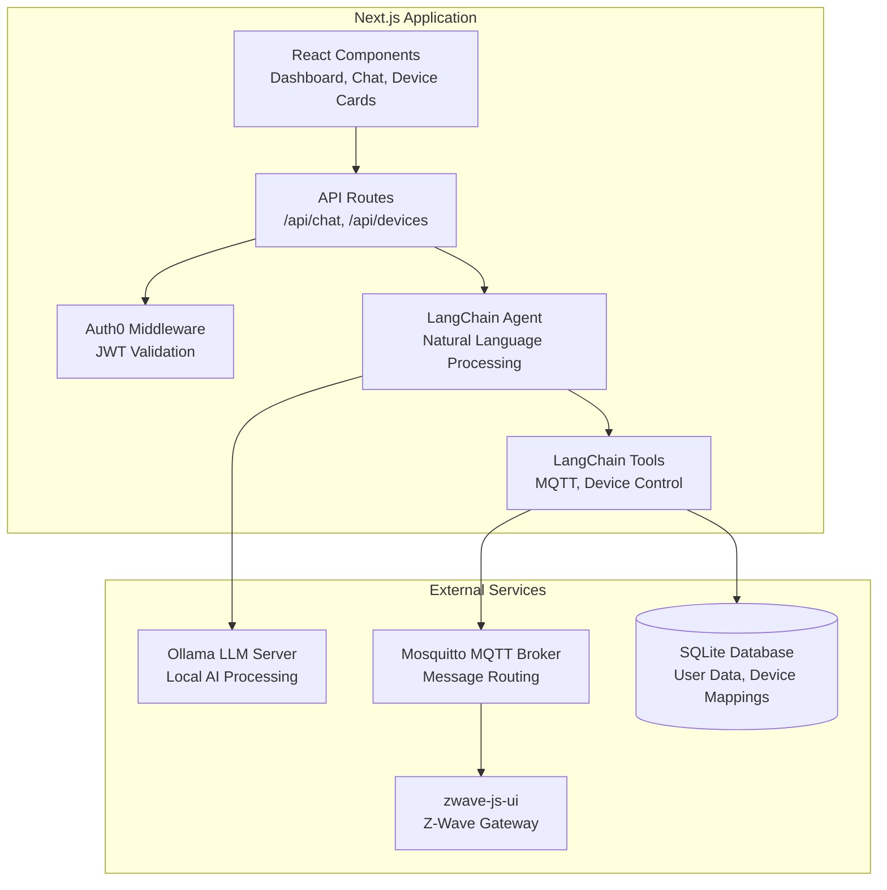

# Design Document

## Overview

This design document outlines the architecture for a local AI-powered home automation system that demonstrates natural language control of Z-Wave devices through MQTT and Ollama. The system is designed for the CodeMash 2026 presentation with a deadline of January 1, 2026.

The system consists of a Next.js web application that integrates LangChain.js with Ollama for natural language processing, MQTT for device communication, and optional Auth0 for authentication. All AI processing happens locally while maintaining secure user authentication.

## Current Implementation Status (October 11, 2025)

### Completed Components
- ✅ **Next.js 15.5.4** application with TypeScript and App Router
- ✅ **Prisma database** with SQLite and seed data (4 devices)
- ✅ **Ollama integration** with streaming chat API
- ✅ **LangChain.js agent** with tool calling capabilities
- ✅ **Chat interface** confirmed functional by user
- ✅ **HiveMQ MQTT broker** running in Kubernetes (10.0.0.58:31883)

### Critical Discovery: Model Compatibility
**IMPORTANT:** Not all Ollama models support LangChain tool calling:
- ❌ **Failed Models:** qwen2.5:3b, gemma2:2b, phi3:3.8b (error: "model does not support tools")
- ✅ **Working Models:** llama3.2:1b (recommended for Pi), llama3.2:3b, mistral
- **Verification:** Look for "Using [tool_name]..." in logs during testing

### Architecture Decision: Auth0 Optional
Auth0 integration has been made optional and deferred to post-demo to focus on core functionality. The system can operate without authentication for demo purposes.

## Architecture

### High-Level System Architecture

```mermaid
graph TB
    User[User Browser] --> NextJS[Next.js 15.5.4<br/>Port 3000]
    NextJS -.-> Auth0[Auth0 Cloud<br/>Authentication<br/>(Optional)]
    NextJS --> Ollama[Ollama LLM<br/>llama3.2:1b<br/>Port 11434]
    NextJS --> MQTT[HiveMQ CE<br/>10.0.0.58:31883]
    MQTT --> ZWave[zwave-js-ui<br/>Port 8091]
    ZWave --> Devices[Z-Wave Devices<br/>Switches, Dimmers, Sensors]
    NextJS --> SQLite[(SQLite Database<br/>Prisma ORM)]
    
    subgraph "Local Network"
        NextJS
        Ollama
        MQTT
        ZWave
        SQLite
        Devices
    end
    
    subgraph "Cloud Services (Optional)"
        Auth0
    end
    
    subgraph "Current Status"
        Status1[✅ Next.js + Prisma Working]
        Status2[✅ Ollama + LangChain Working]
        Status3[✅ HiveMQ Broker Running]
        Status4[🔄 MQTT Client In Progress]
        Status5[⏳ Z-Wave Integration Pending]
    end
```

### Component Architecture



## Components and Interfaces

### 1. Next.js Web Application

**Technology Stack:**
- Next.js 14+ with App Router
- TypeScript for type safety
- TailwindCSS for styling
- React Server Components and Client Components

**Key Components:**

#### Frontend Components
- **Dashboard Page** (`src/app/dashboard/page.tsx`)
  - Device overview grid
  - System status indicators
  - Quick action buttons
- **Chat Interface** (`src/components/ChatInterface.tsx`)
  - Natural language input field
  - Conversation history display
  - Voice input button (stretch goal)
- **Device Cards** (`src/components/DeviceCard.tsx`)
  - Individual device status and controls
  - Real-time state updates via MQTT
- **Settings Page** (`src/app/settings/page.tsx`)
  - Personality configuration
  - Device management
  - User preferences

#### API Routes
- **Chat Endpoint** (`src/app/api/chat/route.ts`)
  - Processes natural language commands
  - Integrates with LangChain agent
  - Returns conversational responses
- **Device Endpoints** (`src/app/api/devices/route.ts`)
  - Device discovery and listing
  - Individual device control
  - State synchronization
- **Auth Endpoints** (`src/app/api/auth/[auth0]/route.ts`)
  - Auth0 callback handling
  - Session management

### 2. LangChain Integration Layer

**Core Agent** (`src/lib/langchain/agent.ts`)
- Ollama LLM integration using `@langchain/ollama`
- Conversation memory management
- Tool orchestration and execution
- Personality system implementation

**Custom Tools:**

#### MQTT Tool (`src/lib/langchain/tools/mqtt-tool.ts`)
```typescript
interface MQTTTool {
  publishCommand(topic: string, payload: object): Promise<void>
  subscribeToTopic(topic: string): Promise<void>
  getDeviceState(deviceId: string): Promise<DeviceState>
  listAllDevices(): Promise<Device[]>
}
```

#### Device Control Tool (`src/lib/langchain/tools/device-tool.ts`)
```typescript
interface DeviceControlTool {
  turnOn(deviceId: string): Promise<boolean>
  turnOff(deviceId: string): Promise<boolean>
  setLevel(deviceId: string, level: number): Promise<boolean>
  getDevicesByRoom(room: string): Promise<Device[]>
  getDevicesByType(type: DeviceType): Promise<Device[]>
}
```

### 3. MQTT Communication Layer

**MQTT Client** (`src/lib/mqtt/client.ts`)
- Singleton pattern for connection management
- Automatic reconnection logic
- Topic subscription management
- Message publishing with QoS handling

**Topic Structure:**
```
home/
├── zwave/
│   ├── [nodeId]/
│   │   ├── status          # Online/offline status
│   │   ├── switch/value    # Binary switch state
│   │   ├── level/value     # Dimmer level (0-100)
│   │   └── sensor/[type]   # Sensor readings
├── system/
│   ├── status              # System health
│   └── discovery           # Device discovery events
└── commands/
    └── [nodeId]/[action]   # Command topics
```

### 4. Authentication System

**Auth0 Integration:**
- Universal Login flow
- JWT token validation
- Session management via cookies
- Middleware-based route protection

**Configuration:**
```typescript
// src/lib/auth0.ts
export const auth0Config = {
  domain: process.env.AUTH0_DOMAIN,
  clientId: process.env.AUTH0_CLIENT_ID,
  clientSecret: process.env.AUTH0_CLIENT_SECRET,
  baseURL: process.env.APP_BASE_URL,
  secret: process.env.AUTH0_SECRET
}
```

### 5. Database Layer

**SQLite Schema** (using Prisma ORM):

```prisma
model User {
  id          String   @id @default(cuid())
  auth0Id     String   @unique
  email       String   @unique
  name        String?
  preferences UserPreferences?
  shortcuts   Shortcut[]
  createdAt   DateTime @default(now())
  updatedAt   DateTime @updatedAt
}

model Device {
  id           String   @id @default(cuid())
  mqttTopic    String   @unique
  friendlyName String
  deviceType   String
  room         String?
  capabilities Json?
  isOnline     Boolean  @default(false)
  lastSeen     DateTime?
  createdAt    DateTime @default(now())
  updatedAt    DateTime @updatedAt
}

model UserPreferences {
  userId        String  @id
  personality   String  @default("helpful")
  voiceEnabled  Boolean @default(false)
  theme         String  @default("dark")
  preferences   Json?
  user          User    @relation(fields: [userId], references: [id])
}

model Shortcut {
  id          String   @id @default(cuid())
  userId      String
  name        String
  command     String
  description String?
  user        User     @relation(fields: [userId], references: [id])
  createdAt   DateTime @default(now())
}

model Conversation {
  id        String   @id @default(cuid())
  userId    String
  message   String
  role      String   // 'user' or 'assistant'
  createdAt DateTime @default(now())
}
```

## Data Models

### Device Model
```typescript
interface Device {
  id: string
  mqttTopic: string
  friendlyName: string
  deviceType: 'switch' | 'dimmer' | 'sensor' | 'thermostat'
  room?: string
  capabilities: {
    canTurnOn: boolean
    canDim: boolean
    hasTemperature: boolean
    hasMotion: boolean
  }
  currentState: {
    isOn?: boolean
    level?: number
    temperature?: number
    motion?: boolean
    lastUpdated: Date
  }
  isOnline: boolean
}
```

### Chat Message Model
```typescript
interface ChatMessage {
  id: string
  role: 'user' | 'assistant'
  content: string
  timestamp: Date
  deviceActions?: DeviceAction[]
}

interface DeviceAction {
  deviceId: string
  action: string
  value?: any
  success: boolean
}
```

### User Preferences Model
```typescript
interface UserPreferences {
  personality: 'helpful' | 'sarcastic' | 'enthusiastic'
  voiceEnabled: boolean
  theme: 'light' | 'dark'
  favoriteDevices: string[]
  customCommands: Record<string, string>
}
```

## Error Handling

### Error Categories and Responses

1. **MQTT Connection Errors**
   - Automatic reconnection with exponential backoff
   - User notification of connection status
   - Graceful degradation to cached device states

2. **Ollama/LLM Errors**
   - Timeout handling (5-second limit)
   - Fallback to simple command parsing
   - Error messages with suggested alternatives

3. **Device Communication Errors**
   - Retry logic for failed commands (max 3 attempts)
   - Device offline detection and user notification
   - Command queuing for offline devices

4. **Authentication Errors**
   - Automatic token refresh
   - Graceful redirect to login
   - Session persistence across browser restarts

### Error Response Format
```typescript
interface ErrorResponse {
  error: {
    code: string
    message: string
    details?: any
    timestamp: Date
  }
  success: false
}
```

## Testing Strategy

### Unit Testing
- **LangChain Tools**: Mock MQTT client, test device control logic
- **MQTT Client**: Mock broker, test connection and message handling
- **Database Operations**: In-memory SQLite for fast tests
- **API Routes**: Mock authentication and external services

### Integration Testing
- **End-to-End Chat Flow**: User input → LangChain → MQTT → Device response
- **Authentication Flow**: Login → Protected route access → Token refresh
- **Real-time Updates**: MQTT message → UI state update
- **Device Discovery**: MQTT topic scanning → Database updates

### Demo Testing
- **Hardware Integration**: Physical Z-Wave devices with real commands
- **Network Resilience**: WiFi disconnection and reconnection
- **Performance Testing**: Response times under load
- **Browser Compatibility**: Chrome, Firefox, Safari testing

### Test Environment Setup
```bash
# Test MQTT broker (HiveMQ CE)
docker run -p 1883:1883 -p 8080:8080 hivemq/hivemq-ce:latest

# Test database
DATABASE_URL="file:./test.db"

# Mock Ollama server
OLLAMA_BASE_URL="http://localhost:11435" # Mock server
```

## Performance Considerations

### Response Time Targets
- **Natural Language Processing**: < 3 seconds (Ollama inference)
- **Device Commands**: < 500ms (MQTT publish/response)
- **UI Updates**: < 100ms (real-time state changes)
- **Page Load**: < 2 seconds (Next.js SSR)

### Optimization Strategies
1. **LLM Optimization**
   - Use smaller models (Qwen2.5:3b, Gemma2:2b)
   - Low temperature (0.1) for consistent responses
   - Prompt optimization for faster inference

2. **MQTT Optimization**
   - QoS 1 for important commands
   - Message batching for bulk operations
   - Connection pooling and keep-alive

3. **Database Optimization**
   - Indexed queries on frequently accessed fields
   - Connection pooling with Prisma
   - Cached device states in memory

4. **Frontend Optimization**
   - Server Components for initial data loading
   - Client Components for real-time updates
   - Optimistic UI updates for better UX

## Security Considerations

### Authentication Security
- JWT token validation on all API routes
- Secure session cookies with httpOnly flag
- CSRF protection via Auth0 state parameter
- Token refresh handling

### MQTT Security
- Username/password authentication for MQTT broker
- Topic-based access control (ACLs)
- TLS encryption for production deployment
- Network isolation (local network only)

### Data Protection
- No sensitive data in logs
- Environment variables for secrets
- Database encryption at rest (SQLite)
- Input validation and sanitization

### Demo Security
- Isolated demo network
- No production credentials
- Mock data for sensitive information
- Secure WiFi for presentation

## Deployment Architecture

## MQTT Broker Selection: Eclipse Mosquitto vs HiveMQ

### Decision: Use HiveMQ Community Edition

**Rationale:**
Given your existing HiveMQ experience and codebase, **HiveMQ Community Edition** is the better choice for this project:

1. **Leverage Existing Knowledge**: Your familiarity with HiveMQ reduces implementation risk and development time
2. **Proven Integration**: Your existing code already works with HiveMQ, reducing integration complexity
3. **Performance**: HiveMQ generally offers better performance and scalability than Mosquitto
4. **Enterprise Features**: Even the Community Edition includes better monitoring and management tools
5. **Demo Reliability**: Using a broker you're already familiar with reduces potential demo failures

### Comparison Analysis

| Factor | HiveMQ CE | Eclipse Mosquitto | Winner |
|--------|-----------|-------------------|--------|
| **Your Experience** | ✅ Existing codebase | ❌ New learning curve | **HiveMQ** |
| **Performance** | ✅ Higher throughput | ⚠️ Good for small scale | **HiveMQ** |
| **Docker Support** | ✅ Official images | ✅ Official images | Tie |
| **License** | ✅ Apache 2.0 (free) | ✅ EPL 2.0 (free) | Tie |
| **Resource Usage** | ⚠️ Higher memory | ✅ Lightweight | **Mosquitto** |
| **Management UI** | ✅ Control Center | ❌ Third-party only | **HiveMQ** |
| **Documentation** | ✅ Excellent | ✅ Good | **HiveMQ** |
| **Home Automation** | ✅ Widely used | ✅ Very popular | Tie |

### Architecture Decision: HiveMQ Community Edition

**Selected: HiveMQ Community Edition**
- Leverages your existing expertise and codebase
- Better performance characteristics for the demo
- Built-in monitoring and management interface
- Reduces implementation and demo risk
- Apache 2.0 license suitable for presentation and distribution

### Development Environment
```yaml
# docker-compose.yml
services:
  hivemq:
    image: hivemq/hivemq-ce:latest
    ports: 
      - "1883:1883"      # MQTT port
      - "8080:8080"      # Management interface
    volumes: 
      - "./hivemq-config:/opt/hivemq/conf"
    environment:
      - HIVEMQ_LOG_LEVEL=INFO
  
  zwave-js-ui:
    image: zwavejs/zwave-js-ui:latest
    ports: ["8091:8091"]
    depends_on: ["hivemq"]
    environment:
      - MQTT_SERVER=hivemq
    devices: ["/dev/ttyUSB0:/dev/ttyUSB0"]
    volumes: ["zwave-data:/usr/src/app/store"]
```

### Production Deployment (Raspberry Pi 5)
- **Ollama**: Native installation on Pi 5
- **Next.js**: Docker container or native Node.js
- **MQTT**: HiveMQ CE Docker container
- **zwave-js-ui**: Docker container with USB device access
- **Database**: SQLite file on persistent storage

### Licensing Considerations

**HiveMQ Community Edition License:**
- **License**: Apache License 2.0 (fully open source)
- **Commercial Use**: ✅ Permitted for commercial applications
- **Distribution**: ✅ Can be redistributed and modified
- **Limitations**: 
  - Limited to 25 concurrent connections (sufficient for demo)
  - No enterprise features (clustering, monitoring extensions)
  - Community support only

**For Production/Enterprise:**
- HiveMQ Professional/Enterprise for advanced features and unlimited connections
- 25 connection limit of CE version is typically sufficient for home automation

**Demo Impact:**
- 25 connection limit is more than sufficient for CodeMash demo
- Apache 2.0 license allows unrestricted use in presentation
- Attendees can replicate the exact setup using HiveMQ CE

### Sources and References
- [HiveMQ Community Edition](https://github.com/hivemq/hivemq-community-edition) - Apache 2.0 licensed
- [HiveMQ CE License Details](https://www.hivemq.com/downloads/community/) - Connection limits and terms
- [HiveMQ vs Mosquitto Performance Comparison](https://www.hivemq.com/blog/mqtt-broker-comparison/)
- [Home Assistant MQTT Broker Recommendations](https://www.home-assistant.io/integrations/mqtt/) - Lists both as popular choices
- [MQTT Broker Benchmarks](https://github.com/krylovsk/mqtt-benchmark) - Performance comparisons

### Kubernetes Deployment (Optional)
- Helm charts for each service
- Persistent volumes for data storage
- ConfigMaps for configuration
- Secrets for sensitive data
- Ingress for external access

## Current Tech Stack Delivered

### Backend
- **Framework:** Next.js 15.5.4 with App Router
- **Language:** TypeScript (strict mode)
- **Database:** SQLite with Prisma 6.16.3 ORM
- **AI:** Ollama + LangChain.js 0.3.35
- **MQTT:** mqtt.js 5.14.1
- **Validation:** Zod 3.25.76

### Frontend
- **Styling:** Tailwind CSS 4.1.14
- **UI Components:** Custom React components
- **State Management:** React hooks and context
- **Real-time:** Server-Sent Events (SSE) for streaming

### AI/ML Stack
- **LLM Runtime:** Ollama (local inference)
- **Models:** 
  - **Development:** llama3.2:1b (tool calling compatible)
  - **Demo:** DeepSeek-R1 70B or Llama 3.3 70B (Mac Studio)
- **Agent Framework:** LangChain.js with ToolCallingAgent
- **Tools:** Custom MQTT and device control tools

### Infrastructure
- **MQTT Broker:** HiveMQ Community Edition (Kubernetes)
- **Z-Wave Gateway:** zwave-js-ui (planned)
- **Database:** SQLite file-based storage
- **Deployment:** Docker containers + Kubernetes

## Model Selection Strategy

### Tool Calling Compatibility Matrix
| Model | Tool Support | Performance | Use Case |
|-------|-------------|-------------|----------|
| llama3.2:1b | ✅ Confirmed | ~20 tok/sec (Pi 5) | Production/Edge |
| llama3.2:3b | ✅ Confirmed | ~15 tok/sec (Pi 5) | Balanced |
| mistral | ✅ Confirmed | Variable | Alternative |
| qwen2.5:3b | ❌ Failed | N/A | Avoid |
| gemma2:2b | ❌ Failed | N/A | Avoid |
| DeepSeek-R1 70B | ✅ Excellent | ~8 tok/sec (Mac) | Demo/Dev |

### Hardware Recommendations
- **Raspberry Pi 5:** llama3.2:1b (1.3GB RAM, <1s response)
- **Mac Studio:** DeepSeek-R1 70B (42GB RAM, rich reasoning)
- **Always verify:** Test tool calling before deployment